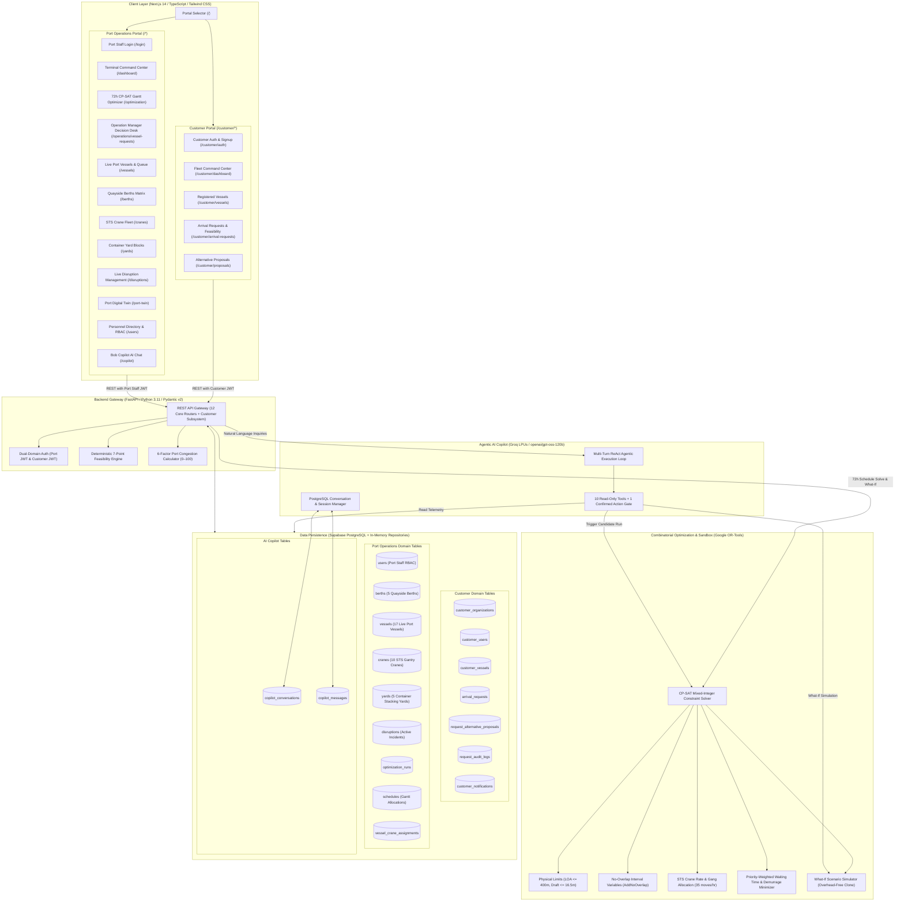
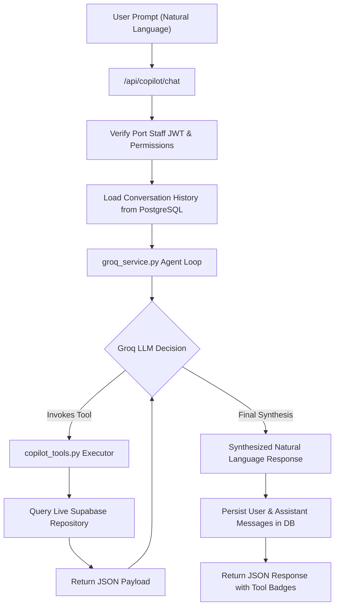
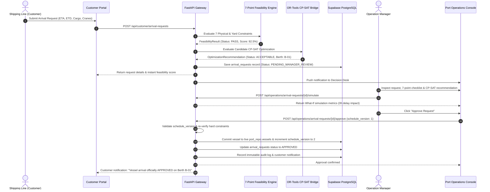

# Technical Architecture: NaviOps Smart Port Optimization Platform

---

## 1. System Architecture Overview

**NaviOps** (developed under project codename **ASTRA**) is engineered as a decoupled, high-performance, two-sided maritime logistics and port optimization platform. It bridges the traditional operational divide between **Commercial Shipping Lines (Customers)** and **Port Authorities & Terminal Operations (Port Operations)**.

The architecture cleanly separates:
1. **Shipping Customer Plane**: Multi-tenant organization accounts, fleet management, vessel arrival requests, and proposal negotiation.
2. **Deterministic Feasibility & Ingestion Engine**: Automated 7-point physical and operational constraint verification.
3. **Combinatorial Optimization Engine**: Mathematical 72-hour berth allocation and crane scheduling powered by **Google OR-Tools CP-SAT**.
4. **What-If Scenario Sandbox & Digital Twin**: Counterfactual scenario simulations with zero risk to live operational state.
5. **Agentic Conversational AI Layer**: **Bob Copilot** powered by Groq LLM inference with 10 real-time operational tools and multi-turn persistence.
6. **Persistence & Data Layer**: Cloud-native **Supabase PostgreSQL** database with connection pooling and dual-domain security isolation.



---

## 2. Component Breakdown & Responsibilities

### 2.1 Frontend Platform (`src/frontend`)
- **Technology:** Next.js 14.2.5 (App Router), React 18.3.1, TypeScript 5.5, Tailwind CSS 3.4, Lucide React, Recharts 2.12, Three.js (`@react-three/fiber`).
- **Portal Routing Structure (23 Page Components):**
  - **Landing Portal Selector (`/`)**: Entry switchboard directing users to either the **Shipping Customer Portal** or the **Port Operations Command Center**.
  - **Shipping Customer Portal (`/customer/*`)**:
    - `/customer/auth`: Multi-tenant shipping company signup, login, and password reset.
    - `/customer/dashboard`: Company fleet metrics, arrival request tracking, and notification center.
    - `/customer/vessels`: Technical fleet registry (IMO, LOA, beam, draft, deadweight, IMDG flag).
    - `/customer/arrival-requests`: Request submission form, 7-point feasibility breakdown, and audit timeline.
    - `/customer/proposals`: Review screen for Port Operations counter-proposals (accept/decline).
    - `/customer/profile`: Organization and user profile settings.
  - **Port Operations Command Center (`/*`)**:
    - `/login` / `/port/login`: Secure staff authentication (100vh non-scrollable viewport).
    - `/dashboard` / `/operations`: Real-time Congestion Index (0–100), KPI gauges, and live queue.
    - `/optimization`: 72-hour CP-SAT Gantt schedule, demurrage financial savings, CO2 abatement, and What-If sandbox.
    - `/operations/vessel-requests`: Operation Manager Decision Desk (Approve, Reject, Propose Alternative, Request Changes).
    - `/vessels`, `/berths`, `/cranes`, `/yards`: Dedicated quayside asset management tables.
    - `/disruptions`: Real-time incident logging, severity penalty tracking, and resolution workflow.
    - `/copilot`: Bob Copilot AI chat assistant with multi-turn history and live tool execution.
    - `/port-twin`: 3D and spatial situational awareness digital twin.
    - `/users`: Personnel administration, RBAC role assignment, and secure credential viewing with copy-to-clipboard.

### 2.2 Backend REST API Gateway (`src/backend/app`)
- **Technology:** Python 3.11+, FastAPI 0.111+, Starlette, Pydantic v2, Uvicorn ASGI.
- **Resource Routers (12 Core Routers + Customer Subsystem):**
  1. `auth.py`: Port staff authentication, PBKDF2 hash verification, and user management.
  2. `dashboard.py`: Consolidated terminal KPIs and 6-factor congestion metrics.
  3. `vessels.py`: Vessel lifecycle management (17 live database records).
  4. `berths.py`: Physical berth status, length/draft capacities, and assigned vessels (5 berths).
  5. `cranes.py`: STS crane telemetry, moves/hour ratings, and maintenance states (10 cranes).
  6. `yards.py`: Yard block capacities, utilized TEUs, and density monitoring (5 yards).
  7. `disruptions.py`: Incident logging, severity scoring, and active disruption resolution.
  8. `optimization.py`: Google OR-Tools solver execution, What-If simulation sandbox, and schedule application.
  9. `copilot.py`: Bob Copilot conversational endpoint with agentic tool loop and action gates.
  10. `conversations.py`: Multi-turn chat session creation, listing, history retrieval, and deletion.
  11. `port_twin.py`: Real-time digital twin state aggregation endpoint.
  12. `operations_requests.py`: Operation Manager vessel arrival review console and decision dispatch.
  13. `customer/router.py`: Customer authentication, fleet registry, arrival requests, and proposal workflows.

### 2.3 Deterministic 7-Point Feasibility Engine (`src/backend/app/customer/services/feasibility.py`)
Executes instant physical and operational pre-validation on incoming vessel arrival requests:
1. **LOA Compatibility (Hard)**: $\text{LOA}_v \le \max(\text{BerthLength})$.
2. **Draft Limit (Hard)**: $\text{Draft}_v \le 16.5\text{m}$ (navigation channel limit with $>1.5\text{m}$ under-keel clearance).
3. **Berth Availability (Hard/Temporal)**: Checks time-window overlaps against scheduled vessels on compatible berths.
4. **STS Crane Fleet (Hard/Operational)**: Validates requested crane gangs against operational unfailed cranes.
5. **Tug & Pilot Services (Hard/Advisory)**: Checks marine weather advisories and pilot availability.
6. **Yard Buffer Capacity (Soft/Hard)**: Validates yard utilization ($<90\%$ PASS, $90\text{--}96\%$ WARN, $>96\%$ FAIL).
7. **IMDG Hazardous Cargo (Hard)**: Validates segregated HazMat yard zones ($<95\%$ threshold).

### 2.4 Mathematical Optimization Engine (`src/backend/app/optimization/optimizer.py`)
- Formulates the Berth Allocation Problem (BAP) and Quay Crane Assignment Problem (QCAP) using **Google OR-Tools CP-SAT**.
- Solves across a 72-hour planning horizon in discrete 1-hour intervals.
- Minimizes cumulative priority-weighted waiting time and unberth tardiness.
- Computes **Demurrage Financials** (\$1,250/hr rate) and **GreenPort Carbon Abatement** (0.35 MT CO2/hr).

### 2.5 What-If Scenario Sandbox Simulation (`src/backend/app/api/optimization.py`)
- Executes counterfactual simulations via `POST /api/optimization/simulate` using cloned in-memory models.
- Accepts overrides: `unavailable_berth_ids`, `unavailable_crane_ids`, `vessel_delay_hours`.
- Returns comparative deltas: waiting time (+/- hours), demurrage financial exposure (\$), CO2 emissions (MT), and congestion score index without altering live database records.

### 2.6 Agentic AI Copilot Service (`src/backend/app/services/groq_service.py`)
- Connects to Groq's high-speed inference API (`openai/gpt-oss-120b`).
- Implements a 5-round agentic execution loop with **10 operational read tools** and **1 confirmation-gated action tool**.
- Grounded directly in live Supabase PostgreSQL data with zero hallucination.

### 2.7 Database Persistence Layer (`src/backend/app/core/database.py` & `src/backend/app/customer/database.py`)
- **Single Source of Truth:** Cloud-hosted **Supabase PostgreSQL 15** with IPv4 pooler connection handling (`prepare_threshold=None`).
- **Synchronized In-Memory Repositories:** High-performance thread-safe `port_repo` and `customer_repo` ensuring sub-millisecond local reads and synchronized PostgreSQL transactional writes.

---

## 3. Google OR-Tools CP-SAT Mathematical Formulation

The scheduling engine solves a discrete-time mixed integer constraint satisfaction model:

### 3.1 Sets & Parameters
- **Time Horizon:** $T = \{0, 1, 2, \dots, 71\}$ (72 one-hour discrete planning intervals).
- **Vessels:** Set $V$ of incoming and waiting vessels requiring service.
  - $ETA_v \in T$: Estimated time of arrival for vessel $v$.
  - $ETD_v \in T$: Target estimated time of departure for vessel $v$.
  - $Length_v$: Length overall (LOA) in meters.
  - $Draft_v$: Operating draft in meters.
  - $Volume_v$: Cargo volume (TEU / Metric Tons).
  - $Priority_v \in \{1, 2, 3, 4\}$: Cargo priority tier ($1 = \text{Critical}, 4 = \text{Low}$).
- **Berths:** Set $B$ of quayside berths ($B\text{-}01$ to $B\text{-}05$).
  - $MaxLength_b$: Physical berth length limit in meters.
  - $AvailableFrom_b$: Current release timestamp if occupied or under maintenance.
- **Cranes:** Set $C$ of operational STS cranes with average throughput rating $Rate_c = 35\text{ moves/hr}$.

### 3.2 Decision Variables
- $Start_v \in [ETA_v, 72]$: Integer variable representing the berthing start hour of vessel $v$.
- $Duration_v$: Integer service duration calculated based on cargo volume and assigned crane capacity:
  $$Duration_v = \max\left(3, \min\left(24, \left\lceil \frac{Volume_v}{2 \cdot 35\text{ moves/hr}} \right\rceil\right)\right)$$
- $End_v = Start_v + Duration_v$: Berthing departure hour.
- $B_{v, b} \in \{0, 1\}$: Boolean presence variable indicating if vessel $v$ is allocated to berth $b$.
- $Interval_{v, b} = \text{NewOptionalIntervalVar}(Start_v, Duration_v, End_v, B_{v, b})$: Optional interval variable on berth $b$.
- $Wait_v = Start_v - ETA_v$: Waiting time at anchorage in hours.
- $Delay_v \ge \max(0, End_v - ETD_v)$: Departure tardiness beyond scheduled ETD.

### 3.3 Constraints
1. **Single Berth Allocation:**
   $$\sum_{b \in Compatible(v)} B_{v, b} = 1 \quad \forall v \in V$$
2. **Physical Length Compatibility:**
   $$B_{v, b} = 0 \quad \text{if } Length_v > MaxLength_b$$
3. **No-Overlap Quayside Intervals (Collision Prevention):**
   $$\text{model.AddNoOverlap}([Interval_{v, b} \mid v \in V]) \quad \forall b \in B$$
4. **Berth Availability Release:**
   $$\text{model.Add}(Start_v \ge AvailableFrom_b).\text{OnlyEnforceIf}(B_{v, b}) \quad \forall v \in V, b \in B$$
5. **Earliest Arrival Time:**
   $$Start_v \ge \max(0, ETA_v) \quad \forall v \in V$$

### 3.4 Objective Function
$$\min \sum_{v \in V} \Big[ Wait_v \cdot W(Priority_v) + Delay_v \cdot \big(2 \cdot W(Priority_v)\big) \Big]$$

Where priority weights are:
- $W(1) = 5$ (Critical priority cargo receives $5\times$ penalty per hour of waiting)
- $W(2) = 3$ (High priority cargo receives $3\times$ penalty)
- $W(3) = 2$ (Standard priority cargo receives $2\times$ penalty)
- $W(4) = 1$ (Low priority cargo receives $1\times$ penalty)

---

## 4. Agentic AI Copilot Architecture & Tooling Matrix

**Bob Copilot** uses Groq's high-speed LPU infrastructure (`openai/gpt-oss-120b`) to run a controlled, stateful tool-calling agent:



### 4.1 Operational Tool Registry (10 Read-Only Tools + 1 Confirmed Action)

| Tool Name | Type | Input Parameters | Responsibility |
|---|---|---|---|
| `get_dashboard_summary` | Read | *None* | Returns high-level terminal metrics: total fleet, waiting count, berthed count, active berths, operating cranes, yard density, and current congestion score. |
| `get_congestion_status` | Read | *None* | Returns the detailed Congestion Index breakdown (0–100), operational status band, factor contributions, and active disruption penalties. |
| `get_waiting_vessels` | Read | `limit?: int` | Returns all vessels currently at anchorage awaiting berth assignment, ordered by longest waiting time first. |
| `get_vessels` | Read | `status_filter?: string`, `limit?: int` | Queries vessels filtered by operational status (`Scheduled`, `Arrived`, `Waiting`, `Berthing`, `Loading`, `Unloading`, `Completed`, `Delayed`). |
| `get_berths` | Read | *None* | Returns quayside berth dimensions, current occupancy status, vessel linkage, and availability timestamps. |
| `get_cranes` | Read | *None* | Queries STS gantry cranes with moves/hour throughput capacity, operational status, and assigned berth. |
| `get_yard_capacity` | Read | *None* | Returns storage utilization, capacity, occupied TEUs, and density percentage across all terminal yard blocks. |
| `get_active_disruptions` | Read | *None* | Returns all currently active operational incidents, weather alerts, equipment faults, and affected assets. |
| `get_latest_optimization_plan` | Read | *None* | Returns the most recent 72-hour CP-SAT optimization result, including vessel start/end times and delay metrics. |
| `simulate_scenario` | Read | `scenario_name: str`, `unavailable_berth_codes?: list`, `unavailable_crane_codes?: list` | Runs a What-If simulation without modifying live data, computing waiting time delta, demurrage financial delta (\$), and congestion shift. |
| `run_optimization` | Action | *None* | Confirmed action gate: generates a candidate 72-hour CP-SAT optimization plan for operator approval. |

---

## 5. Security & Dual-Domain Role-Based Access Control (RBAC)

### 5.1 Dual-Domain Authentication Architecture
- **Port Operations Domain (`domain: "port"`)**:
  - Encoded with Port Staff role claims (`admin`, `operations`, `viewer`).
  - Strict endpoint dependency checking (`require_role(["admin"])`, `require_role(["operations"])`).
- **Customer Domain (`domain: "customer"`, `aud: "naviops-customer-portal"`)**:
  - Encoded with Customer role claims (`CUSTOMER_ADMIN`, `CUSTOMER_USER`) and `org_id`.
  - Organization isolation: all customer queries automatically filter by `organization_id` extracted from the verified JWT.
  - Customer tokens attempting to hit Port APIs (`/api/vessels`, `/api/optimization/run`) are rejected with `401/403`.
- **Password Security**:
  - NIST-compliant PBKDF2-HMAC-SHA256 with 100,000 iterations and a 16-byte random salt.
  - Constant-time hash verification (`secrets.compare_digest`).

### 5.2 RBAC Permission Matrix

| Operation / API Route | Port Admin (`admin`) | Operation Manager (`operations`) | Port Viewer (`viewer`) | Customer Admin (`CUSTOMER_ADMIN`) | Customer User (`CUSTOMER_USER`) |
|---|:---:|:---:|:---:|:---:|:---:|
| `GET /api/dashboard/*` (KPIs, Congestion) | Allowed | Allowed | Allowed | Restricted (401) | Restricted (401) |
| `GET /api/vessels`, `GET /api/berths`, etc. | Allowed | Allowed | Allowed | Restricted (401) | Restricted (401) |
| `POST /api/vessels`, `PUT /api/vessels/*` | Allowed | Allowed | Restricted (403) | Restricted (401) | Restricted (401) |
| `DELETE /api/vessels/*` | Allowed | Restricted (403) | Restricted (403) | Restricted (401) | Restricted (401) |
| `POST /api/disruptions` (Report Incident) | Allowed | Allowed | Restricted (403) | Restricted (401) | Restricted (401) |
| `POST /api/optimization/run` (Solve 72h) | Allowed | Allowed | Restricted (403) | Restricted (401) | Restricted (401) |
| `POST /api/optimization/apply` (Lock Plan) | Allowed | Restricted (403) | Restricted (403) | Restricted (401) | Restricted (401) |
| `POST /api/copilot/chat` (Bob Copilot AI) | Allowed | Allowed | Allowed | Restricted (401) | Restricted (401) |
| `POST /api/operations/arrival-requests/{id}/approve` | Allowed | Allowed | Restricted (403) | Restricted (401) | Restricted (401) |
| `POST /api/operations/arrival-requests/{id}/propose-alternative` | Allowed | Allowed | Restricted (403) | Restricted (401) | Restricted (401) |
| `POST /api/customer/arrival-requests` (Submit Request) | Restricted (401) | Restricted (401) | Restricted (401) | Allowed | Allowed |
| `POST /api/customer/arrival-requests/{id}/accept-alternative` | Restricted (401) | Restricted (401) | Restricted (401) | Allowed | Allowed |
| `POST /api/customer/vessels` (Register Fleet) | Restricted (401) | Restricted (401) | Restricted (401) | Allowed | Allowed |

---

## 6. End-to-End Operational Sequences

### 6.1 Two-Sided Vessel Arrival Request & Approval Sequence



---

## 7. Repository File & Architectural Mapping

```
d:/-bob-ai-hackathon-ASTRA/
├── src/
│   ├── backend/
│   │   ├── app/
│   │   │   ├── api/
│   │   │   │   ├── auth.py                  # Port staff authentication & RBAC
│   │   │   │   ├── dashboard.py             # Terminal KPIs & congestion breakdown
│   │   │   │   ├── vessels.py               # Live port vessel fleet management
│   │   │   │   ├── berths.py                # Quayside berths status & capacities
│   │   │   │   ├── cranes.py                # STS gantry crane telemetry
│   │   │   │   ├── yards.py                 # Yard block storage utilization
│   │   │   │   ├── disruptions.py           # Disruption logging & resolution
│   │   │   │   ├── optimization.py          # CP-SAT solver & What-If sandbox
│   │   │   │   ├── copilot.py               # Bob Copilot Groq AI chat endpoint
│   │   │   │   ├── conversations.py         # Multi-turn chat persistence
│   │   │   │   ├── port_twin.py             # Real-time port digital twin state
│   │   │   │   └── operations_requests.py   # Operation Manager Decision Desk
│   │   │   ├── core/
│   │   │   │   ├── config.py                # Pydantic settings & DB connection pooler
│   │   │   │   ├── database.py              # PortRepository, SyncedTable & Supabase sync
│   │   │   │   └── auth.py                  # PBKDF2 password hashing & Port JWTs
│   │   │   ├── customer/
│   │   │   │   ├── auth.py                  # Customer PBKDF2 & Customer JWTs
│   │   │   │   ├── database.py              # CustomerRepository & PostgreSQL sync
│   │   │   │   ├── router.py                # Customer portal endpoints
│   │   │   │   ├── schemas.py               # Pydantic schemas for customer domain
│   │   │   │   └── services/
│   │   │   │       ├── feasibility.py       # Deterministic 7-Point Feasibility Engine
│   │   │   │       └── optimization_bridge.py # CP-SAT Candidate Optimization Bridge
│   │   │   ├── congestion/
│   │   │   │   └── calculator.py            # 6-Factor Congestion Index (0–100)
│   │   │   ├── models/
│   │   │   │   └── schemas.py               # Port operations Pydantic v2 schemas
│   │   │   ├── optimization/
│   │   │   │   └── optimizer.py             # Google OR-Tools CP-SAT formulation
│   │   │   └── services/
│   │   │       ├── groq_service.py          # Groq agentic loop & LLM client
│   │   │       ├── copilot_tools.py         # 10 Read-Only Operational Tools + Action
│   │   │       └── conversation_repo.py     # PostgreSQL conversation persistence
│   │   ├── tests/                           # 95 automated pytest test cases (100% pass)
│   │   │   ├── test_backend.py
│   │   │   ├── test_auth_and_user_persistence.py
│   │   │   ├── test_data_safety_and_crud.py
│   │   │   ├── test_disruptions_flow.py
│   │   │   ├── test_password_and_view_profile_security.py
│   │   │   ├── test_copilot_phase2.py
│   │   │   └── test_customer_module.py
│   │   ├── requirements.txt                 # Backend dependencies
│   │   └── .env.example                     # Configuration template
│   ├── frontend/
│   │   ├── app/                             # Next.js 14 App Router (23 page components)
│   │   │   ├── page.tsx                     # Landing Portal Selector (/)
│   │   │   ├── login/page.tsx               # Port Operations Login (100vh viewport)
│   │   │   ├── dashboard/page.tsx           # Operational Overview Command Center
│   │   │   ├── operations/page.tsx          # Live Operations Dispatch Console
│   │   │   ├── optimization/page.tsx        # 72h CP-SAT Gantt & What-If Sandbox
│   │   │   ├── vessels/page.tsx             # Live Port Fleet Management
│   │   │   ├── berths/page.tsx              # Quayside Berths Matrix
│   │   │   ├── cranes/page.tsx              # STS Crane Fleet Management
│   │   │   ├── yards/page.tsx               # Container Stacking Yards
│   │   │   ├── disruptions/page.tsx         # Disruption Logging & Resolution
│   │   │   ├── copilot/page.tsx             # Bob Copilot Interactive AI Chat
│   │   │   ├── port-twin/page.tsx           # 3D Port Digital Twin
│   │   │   ├── users/page.tsx               # Personnel Directory & RBAC Admin
│   │   │   ├── operations/vessel-requests/  # Operation Manager Decision Desk
│   │   │   └── customer/                    # Shipping Customer Portal routes
│   │   │       ├── auth/page.tsx            # Customer Signup & Login
│   │   │       ├── dashboard/page.tsx       # Customer Fleet Overview
│   │   │       ├── vessels/page.tsx         # Customer Fleet Registry
│   │   │       ├── arrival-requests/        # Arrival Request Submission & Detail
│   │   │       ├── proposals/page.tsx       # Alternative Proposal Acceptance
│   │   │       └── profile/page.tsx         # Organization Profile
│   │   ├── components/                      # Design system, modals, Gantt, cards
│   │   ├── lib/                             # API clients (api.ts, customer-api.ts)
│   │   ├── types/                           # TypeScript definitions
│   │   ├── package.json                     # Frontend dependencies
│   │   └── tailwind.config.js               # Enterprise maritime styling
│   └── database/
│       ├── schema.sql                       # Primary Supabase PostgreSQL schema
│       └── migrations/
│           ├── 001_copilot_conversations.sql # Copilot chat persistence DDL
│           └── 002_customer_module.sql       # Customer domain & requests DDL
└── docs/                                    # Technical documentation
    ├── problem-statement.md
    ├── solution-overview.md
    ├── architecture.md
    └── setup-guide.md
```
