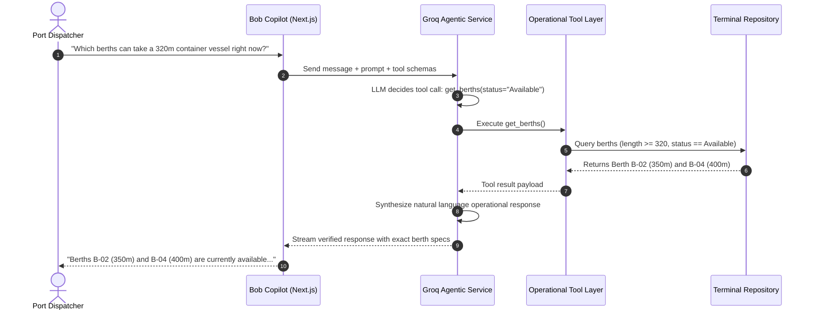

# Solution Overview: NaviOps Smart Port Optimization Platform

---

## 1. Executive Summary

**NaviOps** is an industrial-grade, AI-powered Smart Port Operations Command Center and 72-Hour Decision Support System. Developed for commercial container terminals and port authorities, NaviOps bridges the gap between quayside telemetry, mathematical combinatorial optimization, and conversational artificial intelligence.

At its core, NaviOps replaces manual spreadsheet guesswork and static rule-of-thumb heuristics with **Google OR-Tools CP-SAT constraint programming**. It computes optimal, collision-free 72-hour vessel berthing and crane allocation schedules within seconds. Paired with a transparent, rule-based **Port Congestion Index (0–100)** and **Bob Copilot**—an agentic LLM assistant powered by Groq LPUs with live operational tool calling—NaviOps empowers port managers and dispatchers to navigate dynamic disruptions with unprecedented speed, transparency, and precision.

```
┌─────────────────────────────────────────────────────────────────────────────────────────────────────────┐
│                                       NAVI OPS PLATFORM CAPABILITIES                                   │
├──────────────────────────┬──────────────────────────┬──────────────────────────┬────────────────────────┤
│   Real-Time Telemetry    │  Congestion Index (0-100)│   OR-Tools Optimization │   Bob Copilot (Groq)   │
│  14 Vessels, 5 Berths,   │  Anchorage (35%), Berth  │  72h CP-SAT non-overlap  │  9 Live operational    │
│  10 Cranes, 5 Yard Zones │  (25%), Cranes (25%),    │  integer programming     │  tools + safe human-in- │
│  + Active Disruptions    │  Yard (15%) + Penalties  │  priority-weighted wait  │  the-loop action gate  │
└──────────────────────────┴──────────────────────────┴──────────────────────────┴────────────────────────┘
```

---

## 2. Core Functional Pillars

### 2.1 Transparent Port Congestion Index (0–100)
Rather than treating congestion as an arbitrary or subjective estimate, NaviOps calculates a transparent, deterministic composite metric updated in real time:

$$\text{Congestion Index} = \min\left(100, \sum_{i} w_i \cdot R_i + \sum_{d \in \text{Disruptions}} P_d\right)$$

- **Anchorage Queue Pressure ($w_1 = 0.35$):** Ratio of vessels waiting at anchorage relative to total operational fleet capacity.
- **Berth Utilization ($w_2 = 0.25$):** Percentage of active berths occupied by berthed or servicing vessels.
- **Quayside Crane Saturation ($w_3 = 0.25$):** Percentage of operational Ship-to-Shore (STS) gantry cranes currently assigned and operating.
- **Yard Stacking Density ($w_4 = 0.15$):** Aggregate container storage density across terminal yard blocks.
- **Additive Disruption Penalties ($P_d$):** Fixed severity penalties for active incidents:
  - `Low`: +1 point
  - `Medium`: +2 points
  - `High`: +5 points
  - `Critical`: +10 points

The resulting score maps directly into operational action bands:
- **0–30 (Low - Green):** Normal fluid flow; terminal operates within design capacity.
- **31–60 (Moderate - Amber):** Heightened traffic; early warning for dispatchers to stage equipment.
- **61–80 (High - Orange):** Significant delays; anchorage queues forming; optimization recommended.
- **81–100 (Critical - Red):** Severe quayside bottleneck; mandatory re-optimization and schedule adjustments.

---

### 2.2 72-Hour Discrete Combinatorial Optimization (Google OR-Tools CP-SAT)
When vessels bunch or equipment breaks down, re-scheduling manually takes hours. NaviOps formulates the **Berth Allocation Problem (BAP)** and **Quay Crane Assignment Problem (QCAP)** as a constraint satisfaction and integer programming model over a 72-hour planning horizon discretized into 1-hour time slots:

1. **Physical Compatibility Constraints:** A vessel $v$ can only be assigned to berth $b$ if $Length_v \le MaxLength_b$ and $Draft_v \le MaxDraft_b$.
2. **Single Berth Allocation:** Each scheduled vessel is allocated exactly one compatible berth over the planning window.
3. **No-Overlap Interval Constraints:** Berths are modeled as non-overlapping interval resources (`model.AddNoOverlap`). No two vessels can occupy the same berth during overlapping time intervals.
4. **Crane Capacity & Handling Speed:** Vessel service duration is derived from cargo container moves divided by the assigned STS crane moves/hour throughput.
5. **Disruption Inactivity Windows:** Berths or cranes undergoing maintenance or breakdown cannot accept intervals during their active disruption windows.
6. **Temporal Feasibility:** Berthing start time cannot precede vessel estimated time of arrival ($Start_v \ge ETA_v$).
7. **Priority-Weighted Objective:** Minimizes cumulative priority-weighted waiting time and unberth tardiness:
   $$\min \sum_{v} \left( w_{\text{priority}}(v) \cdot (Start_v - ETA_v) + \alpha \cdot \max(0, End_v - ETD_v) \right)$$
   Where Priority 1 (Critical Cargo) receives a $5\times$ weight, Priority 2 (High) receives $3\times$, Priority 3 (Standard) receives $2\times$, and Priority 4 (Low) receives $1\times$.

---

### 2.3 Interactive 72-Hour Gantt Timeline & Human-in-the-Loop Control
NaviOps features an interactive 72-hour visual Gantt schedule:
- **Visual Schedule Inspection:** Displays discrete berthing intervals across all 5 berths color-coded by vessel priority and status.
- **Disruption Overlay:** Active maintenance and incident windows appear directly on berth tracks to highlight why vessels are shifted.
- **Safe Human-in-the-Loop Governance:** Generating an optimization plan computes candidate assignments without overwriting live operational schedules. The Port Manager inspects the delay reductions, total wait time delta, and crane allocations before clicking **Approve & Apply Plan**.

---

### 2.4 Quayside & Yard Asset Telemetry
The command center provides dedicated telemetry modules across all terminal assets:
- **14 Vessels:** Track IMO number, name, type, priority, TEU cargo moves, length overall (LOA), draft, assigned berth, ETA, ETD, and operational status (`Anchorage`, `In Transit`, `Berthed`, `Departed`).
- **5 Berths:** Track length, depth draft, maximum crane capacity, current assigned vessel, and status (`Available`, `Occupied`, `Maintenance`).
- **10 STS Gantry Cranes:** Track crane identifier, operational rating (moves/hour), assigned berth, assigned vessel, and status (`Operational`, `Assigned`, `Maintenance`).
- **5 Yard Storage Zones:** Monitor TEU storage capacity, current utilized TEUs, stacking percentage, and congestion state.
- **Active Disruptions:** Central log of real-time events (equipment faults, weather advisories, channel maintenance) with timestamps, severity levels, and affected asset links.

---

### 2.5 Bob Copilot: Agentic AI with Controlled Tool Execution
Rather than relying on generic, ungrounded conversational LLMs, NaviOps integrates **Bob Copilot**, an agentic AI assistant powered by Groq's high-speed inference engine (`openai/gpt-oss-120b`).



**Key Copilot Architectural Safeguards:**
- **9 Live Operational Read Tools:** `get_dashboard_summary`, `get_congestion_status`, `get_waiting_vessels`, `get_vessels`, `get_berths`, `get_cranes`, `get_yard_capacity`, `get_active_disruptions`, and `get_latest_optimization_plan`.
- **Action Confirmation Gate:** For state-modifying actions like `run_optimization`, Copilot executes an action tool that generates a structured proposal requiring human confirmation before changes are applied.
- **Zero Hallucination on Terminal Data:** The LLM does not guess vessel names, berth availability, or queue counts; all metrics are fetched dynamically via JSON tool execution.
- **Multi-Turn Persistent Memory:** Conversations are stored in PostgreSQL / SQLite tables (`conversations` and `conversation_messages`), allowing operators to resume previous planning sessions seamlessly.

---

### 2.6 Enterprise Role-Based Access Control (RBAC)
NaviOps enforces strict role separation across the frontend UI and backend API:

| Role Persona | Default Credentials | Permissions & Operational Scope |
|---|---|---|
| **Port Manager / Admin** | `admin@naviops.port` / `admin123` | Full access: Quayside CRUD, disruption reporting & resolution, trigger & **approve/apply** optimization plans, user creation, and role administration. |
| **Operations Staff** | `ops@naviops.port` / `admin123` | Operational execution: Telemetry viewing, vessel updates, crane assignments, incident reporting, and candidate optimization runs. Cannot apply plans or manage user roles. |
| **Executive Viewer** | `executive@naviops.port` / `admin123` | Strategic observation: Read-only access to overview KPIs, congestion indices, berth occupancy, Gantt schedule, and fleet summaries. Write actions disabled. |

The system includes a dedicated `/users` administrative portal with in-modal user creation, live role modification, and safety guards preventing demotion of the final administrator.

---

## 3. End-to-End Operational Workflow

```
┌──────────────────────────────────────────────────────────────────────────────────────────────────┐
│                                END-TO-END OPERATIONAL LIFECYCLE                                  │
└──────────────────────────────────────────────────────────────────────────────────────────────────┘

 1. Fleet Arrival & Telemetry Ingestion
    │ Incoming vessels transmit ETA, draft, length, and cargo moves via AIS/EDI.
    ▼
 2. Real-Time Congestion Diagnostic
    │ Congestion engine evaluates queue ratio, berth occupancy, and crane loads.
    │ Composite index (0–100) displays terminal state across dashboards.
    ▼
 3. Dynamic Disruption Logging
    │ Dispatcher logs an event (e.g., Crane CR-02 motor failure).
    │ Congestion index immediately increases (+5 High penalty); affected crane locked.
    ▼
 4. Combinatorial Optimization Trigger
    │ Dispatcher triggers OR-Tools CP-SAT 72h optimization via UI or Bob Copilot.
    │ Solver models interval variables, checks non-overlap, and minimizes waiting time.
    ▼
 5. Visual Gantt Review & Verification
    │ Port Manager inspects the newly proposed timeline, verifying zero berth overlaps
    │ and checking the wait-time reduction metrics.
    ▼
 6. Schedule Approval & Application
    │ Admin clicks "Approve & Apply Plan". Candidate assignments become active.
    ▼
 7. Conversational Inquiries via Bob Copilot
    │ Operators query Bob Copilot in natural language for vessel status, crane rates,
    │ or further downstream scheduling inquiries.
```

---

## 4. Key Architectural & Design Decisions

| Decision | Alternative Considered | Engineering Rationale |
|---|---|---|
| **Google OR-Tools CP-SAT Solver** | Heuristics (FIFO) or Genetic Algorithms | CP-SAT guarantees mathematical optimality or provable feasibility bounds. Heuristics yield suboptimal berth utilization, while Genetic Algorithms lack deterministic repeatability for audit compliance. |
| **Agentic Tool-Calling Loop (Groq)** | Free-form ungrounded LLM generation | Real port dispatchers cannot tolerate hallucinated vessel lengths or berth numbers. The 5-round tool loop ensures every claim is backed by JSON payloads from the live database. |
| **Dual-Mode Persistence (SyncedTable + Supabase)** | Pure cloud-only database dependency | Allows the platform to boot and run self-contained out-of-the-box for hackathon judging and offline evaluation, while seamlessly syncing with Supabase PostgreSQL when cloud credentials are provided. |
| **High-Density Light Theme Command Center** | Dark-mode consumer dashboard | Maritime operations centers adhere to strict daytime legibility standards. High-contrast typography, clear data tables, and distinct status badges reduce operator fatigue. |
| **Two-Step Optimization Approval** | Fully autonomous schedule application | Port authorities operate under maritime safety regulations where human harbor masters maintain legal responsibility for vessel berthing assignments. |

---

## 5. Technology Stack Summary

| Layer | Component | Version / Library | Responsibility |
|---|---|---|---|
| **Frontend** | Framework | Next.js 14.2.5 (App Router) | Client-side routing across 14 pages, server rendering, layout state. |
| | Language | TypeScript 5.x | Type safety across operational schemas and API responses. |
| | Styling | Tailwind CSS 3.4 | Responsive, clean high-density enterprise command center UI. |
| | Data Viz | Recharts & Custom Gantt | Real-time charts, congestion distribution, and 72h timeline. |
| | Icons | Lucide React | Standardized operational iconography. |
| **Backend** | Framework | FastAPI 0.115+ / Starlette | High-performance asynchronous REST API gateway. |
| | Language | Python 3.11+ | Business logic, mathematical formulation, and agent loops. |
| | Validation | Pydantic v2 & Pydantic-Settings | Strict request/response validation and environment management. |
| | Server | Uvicorn | ASGI production server with reload capabilities. |
| **Optimization** | Solver | Google OR-Tools 9.11+ | CP-SAT discrete constraint programming solver. |
| **AI Layer** | Inference | Groq API (`openai/gpt-oss-120b`) | Ultra-fast token generation for multi-turn tool-calling loops. |
| | Tools | 9 Read + 1 Action Tool | Grounded REST queries to the internal repository. |
| **Data & Auth** | Persistence | SyncedTable + Supabase PostgreSQL | Thread-safe in-memory cache with PostgreSQL database syncing. |
| | Security | PBKDF2-HMAC-SHA256 & JWT | NIST-compliant password hashing and bearer token authentication. |
